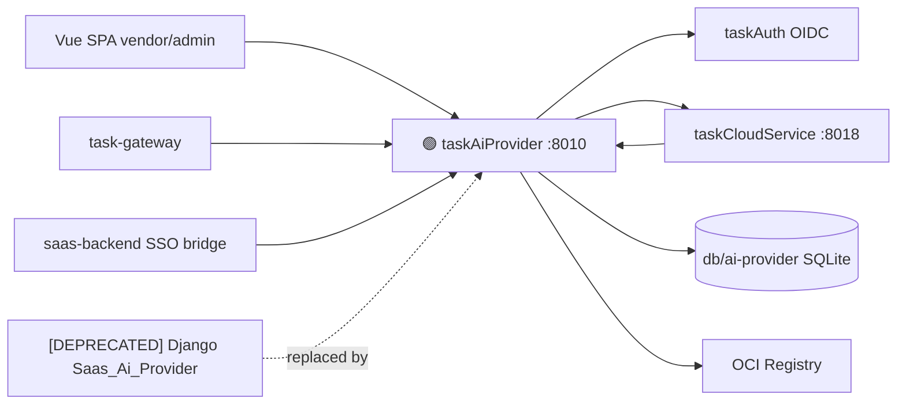

# Application Integration v32 — taskAiProvider Go Migration

## Plateau / Gap

- **Plateau v31 ✅ current**: OTP/SMS 全切 Go（taskAuth）
- **Gap closed**: ai-provider 仍为 Django，与 Go-first 元规则及运维目标冲突；删除 Python 前置未满足；go-split Non-Goal 废止
- **Plateau v32 🎯 target**: `taskAiProvider` Go 直替 :8010；同库同契约；清理 Python `Saas_Ai_Provider`
