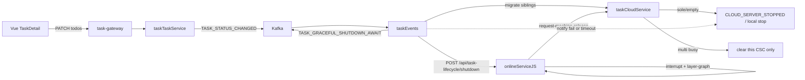

# Application Integration v33 — Terminal Graceful Container Shutdown (current)

```mermaid
flowchart LR
  Vue["Vue TaskDetail"] -->|PATCH todos| GW["task-gateway"]
  GW --> TTS["taskTaskService"]
  TTS -->|TASK_STATUS_CHANGED| Kafka
  Kafka --> TE["taskEvents"]
  TE -->|migrate siblings| Cloud["taskCloudService"]
  TE -->|POST /api/task-lifecycle/shutdown| OSJS["onlineServiceJS"]
  TE -->|TASK_GRACEFUL_SHUTDOWN_AWAIT| Kafka
  OSJS -->|interrupt + layer-graph| OSJS
  OSJS -->|request-machine-release| Cloud
  Cloud -->|sole/empty| Stop["CLOUD_SERVER_STOPPED / local stop"]
  Cloud -->|multi busy| Clear["clear this CSC only"]
  TE -.->|notify fail or timeout| Stop
```

## 状态

✅ **current**（2026-07-16 交付）
