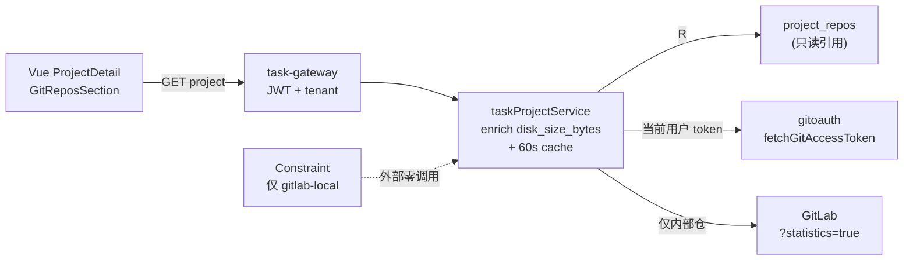

# Application Integration v34 — Internal Repo Disk Size

## Plateau / Gap

- **Plateau v33 📦 archived**: 终态优雅通知容器收尾与回调释放
- **Gap closed**: 项目详情无法展示平台内部仓磁盘占用；外部仓不应展示
- **Plateau v34 ✅ current**: 详情 enrich `is_internal` + `disk_size_bytes`；60s 短缓存；前端条件徽章；无新公网 path
