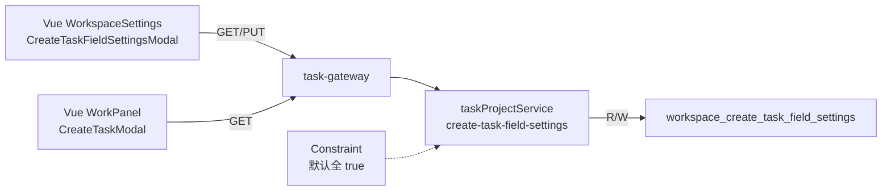

# Application Integration v35 — Create Task Field Settings

## Plateau / Gap

- **Plateau v34 ✅ current**: 项目详情内部仓磁盘占用
- **Gap**: 创建任务可选字段始终展示，无法按工作区精简
- **Plateau v35 ✅ current**: 工作区可配置创建任务可选字段显隐；默认全开
