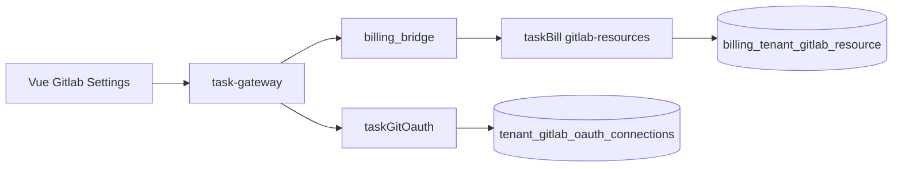
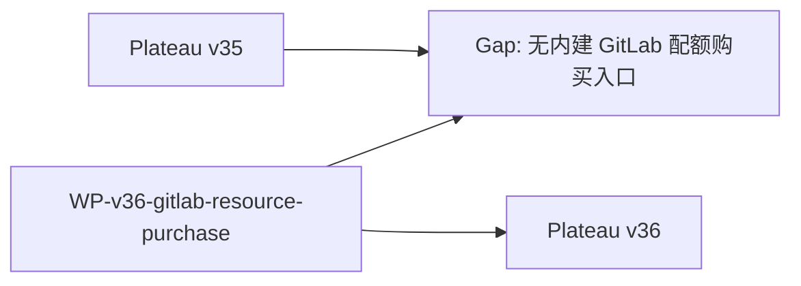

# Application Integration v36 — Tenant GitLab Settings Resource Purchase

## Target topology

```mermaid
flowchart LR
  Vue[Vue Gitlab Settings] --> GW[task-gateway]
  GW --> Bridge[billing_bridge]
  Bridge --> Bill[taskBill gitlab-resources]
  Bill --> T[(billing_tenant_gitlab_resource)]
  GW --> OAuth[taskGitOauth]
  OAuth --> C[(tenant_gitlab_oauth_connections)]
```

## Architecture migration v35 → v36

```mermaid
flowchart LR
  P35[Plateau v35] --> Gap[Gap: 无内建 GitLab 配额购买入口]
  WP[WP-v36-gitlab-resource-purchase] --> Gap
  WP --> P36[Plateau v36]
```
