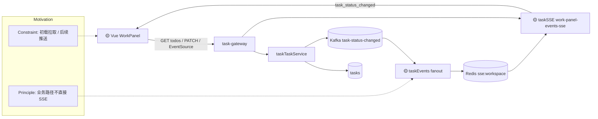
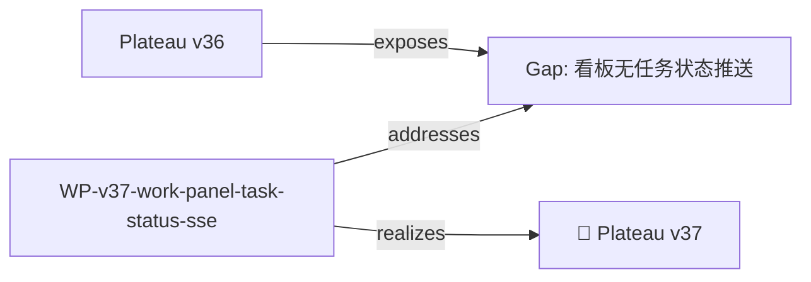

# v37 Application Integration — Work Panel Task Status SSE

```mermaid
flowchart LR
  subgraph Motivation
    C[Constraint: 初载拉取 / 后续推送]
    P[Principle: 业务路径不直接 SSE]
  end

  Vue["🟡 Vue WorkPanel"]
  GW[task-gateway]
  TTS[taskTaskService]
  TE["🟡 taskEvents fanout"]
  SSE["🟡 taskSSE work-panel-events-sse"]
  Tasks[(tasks)]
  Kafka[(Kafka task-status-changed)]
  Redis[(Redis sse:workspace)]

  Vue -->|GET todos / PATCH / EventSource| GW
  GW --> TTS
  GW --> SSE
  TTS --> Tasks
  TTS --> Kafka
  Kafka --> TE
  TE --> Redis
  Redis --> SSE
  SSE -->|task_status_changed| Vue
  C -.-> Vue
  P -.-> TE
```

## 架构变迁 v36→v37

```mermaid
flowchart LR
  P36[Plateau v36] -->|exposes| Gap[Gap: 看板无任务状态推送]
  WP[WP-v37-work-panel-task-status-sse] -->|addresses| Gap
  WP -->|realizes| P37[🎯 Plateau v37]
```
