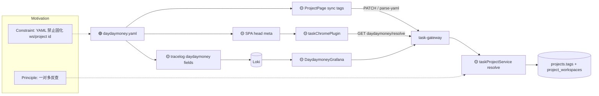
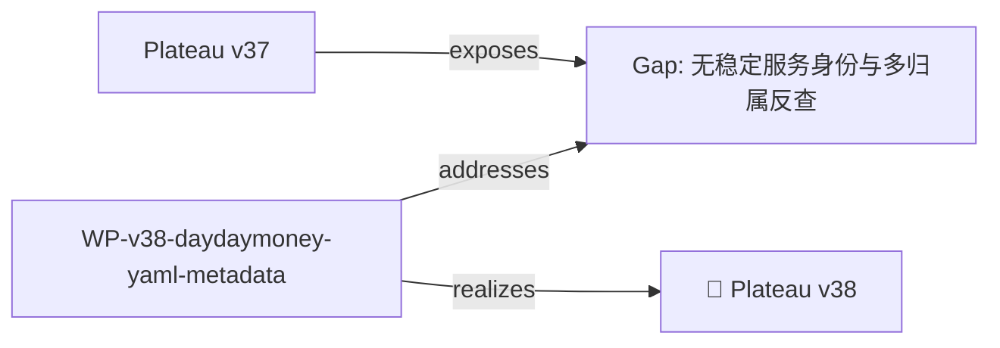

# v38 Application Integration — daydaymoney.yaml 元信息全链路

```mermaid
flowchart LR
  subgraph Motivation
    C[Constraint: YAML 禁止固化 ws/project id]
    P[Principle: 一对多反查]
  end

  YAML["🟢 daydaymoney.yaml"]
  VueHead["🟡 SPA head meta"]
  VueProj["🟡 ProjectPage sync tags"]
  Chrome["🟡 taskChromePlugin"]
  Grafana["🟡 DaydaymoneyGrafana"]
  GW[task-gateway]
  TPS["🟡 taskProjectService resolve"]
  Tags[(projects.tags + project_workspaces)]
  Tracelog["🟡 tracelog daydaymoney fields"]
  Loki[(Loki)]

  YAML --> VueHead
  YAML --> VueProj
  YAML --> Tracelog
  VueHead --> Chrome
  VueProj -->|PATCH / parse-yaml| GW
  Chrome -->|GET daydaymoney/resolve| GW
  Grafana --> GW
  GW --> TPS
  TPS --> Tags
  Tracelog --> Loki
  Loki --> Grafana
  C -.-> YAML
  P -.-> TPS
```

## 架构变迁 v37→v38

```mermaid
flowchart LR
  P37[Plateau v37] -->|exposes| Gap[Gap: 无稳定服务身份与多归属反查]
  WP[WP-v38-daydaymoney-yaml-metadata] -->|addresses| Gap
  WP -->|realizes| P38[🎯 Plateau v38]
```
