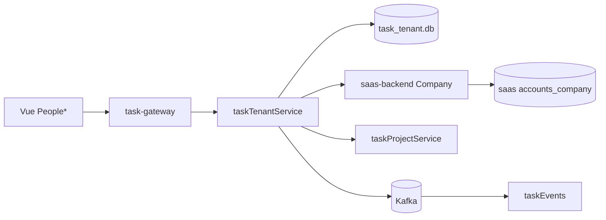
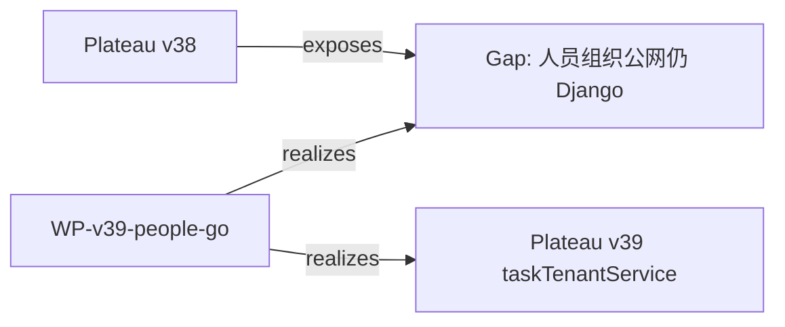

# v39 Application Integration — 人员组织 API 迁 taskTenantService

```mermaid
flowchart LR
  Vue["Vue People*"] --> GW["task-gateway"]
  GW --> TTS["taskTenantService"]
  TTS --> TDB[("task_tenant.db")]
  TTS --> DJ["saas-backend Company"]
  DJ --> SaaS[("saas accounts_company")]
  TTS --> TPS[taskProjectService]
  TTS --> K[(Kafka)]
  K --> TE[taskEvents]
```

## 架构变迁 v38→v39

```mermaid
flowchart LR
  P38[Plateau v38] -->|exposes| Gap[Gap: 人员组织公网仍 Django]
  WP[WP-v39-people-go] -->|realizes| Gap
  WP -->|realizes| P39[Plateau v39 taskTenantService]
```
