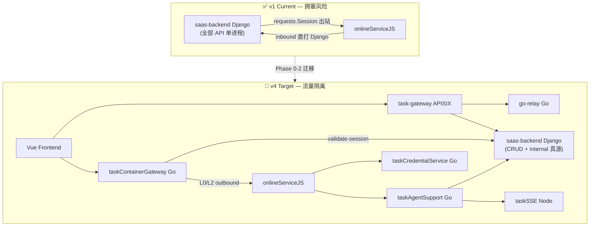
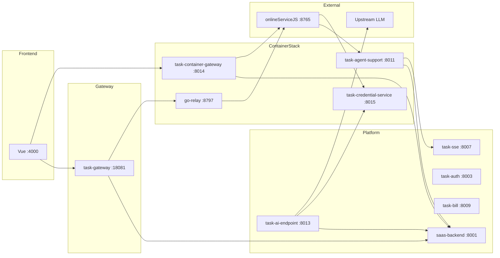

# Application Integration — v4 Target Architecture

> **状态**: 🎯 target | **版本**: v4 | **迭代**: task2app 接口 Go 拆分 | **基于**: v3  
> **设计日期**: 2026-07-05 15:31

## 架构变迁总览 (v1 → v4)

## 组件拓扑

## v4 变更明细

| 标记 | 组件/关系 | 说明 |
|------|-----------|------|
| 🟢 NEW | onlineServiceJS 显式标注 | 容器 HTTP API 真源 |
| 🟡 MOD | taskContainerGateway | 完整 compute outbound + job-stream |
| 🟡 MOD | go-relay | 浏览器 relay 公网入口 |
| 🟡 MOD | taskAgentSupport | inbound 业务逻辑下沉 |
| 🟡 MOD | saas-backend | 瘦身为 CRUD + internal |
| 🔴 DEP | Django inline SSE | → taskSSE |
| 🔴 DEP | relay_to_trae_proxy | → go-relay 直路由 |
