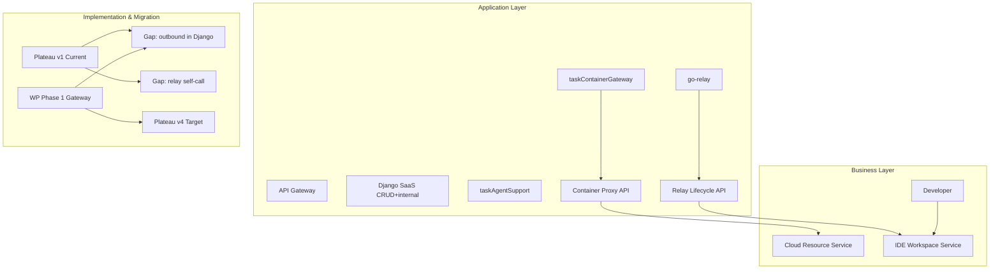

# Enterprise Landscape — v4 Target Architecture

> **状态**: 🎯 target | **版本**: v4 | **迭代**: task2app 接口 Go 拆分 | **基于**: v3  
> **设计日期**: 2026-07-05 15:31

## 三层视图 + 架构变迁

## 架构变迁 Plateau 对照

| Plateau | 状态 | 容器出站 | relay 入口 | Django 职责 |
|---------|------|----------|------------|-------------|
| v1 Current | ✅ 已交付 | Django requests | Django proxy | 全量 API |
| v4 Target | 🎯 本次 | taskContainerGateway | go-relay 直路由 | CRUD + internal |
