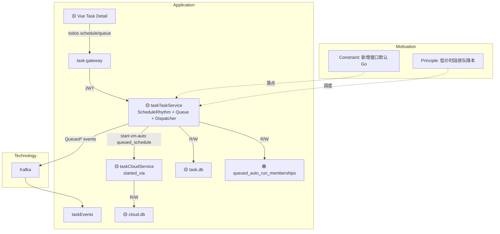
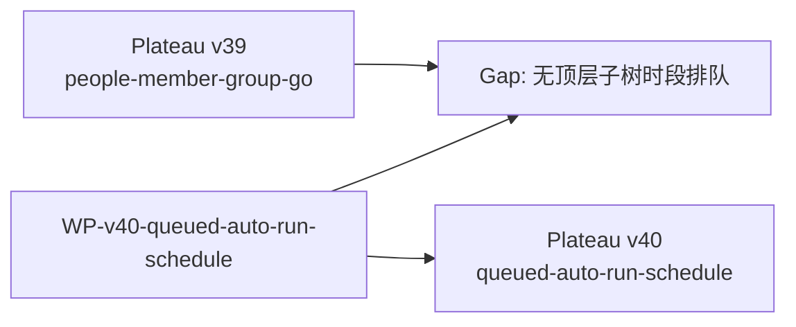

# Application Integration v40 — Top Deliverable Queued Auto-Run Schedule

```mermaid
flowchart TB
  subgraph Motivation
    goFirst["Constraint: 新增接口默认 Go"]
    costAware["Principle: 低价时段排队降本"]
  end

  subgraph Application
    vueTask["🟡 Vue Task Detail"]
    gw["task-gateway"]
    tts["🟡 taskTaskService<br/>ScheduleRhythm + Queue + Dispatcher"]
    tcs["🟡 taskCloudService<br/>started_via"]
    te["taskEvents"]
    taskDB["🟡 task.db"]
    qarm["🟢 queued_auto_run_memberships"]
    cloudDB["🟡 cloud.db"]
  end

  subgraph Technology
    kafka["Kafka"]
  end

  vueTask -->|todos schedule/queue| gw
  gw -->|JWT| tts
  tts -->|R/W| taskDB
  tts -->|R/W| qarm
  tts -->|start-vm-auto queued_schedule| tcs
  tcs -->|R/W| cloudDB
  tts -->|Queued* events| kafka
  kafka --> te
  goFirst -.->|落点| tts
  costAware -.->|调度| tts
```

## 架构变迁 v39→v40

```mermaid
flowchart LR
  p39["Plateau v39<br/>people-member-group-go"] --> gap["Gap: 无顶层子树时段排队"]
  wp["WP-v40-queued-auto-run-schedule"] --> gap
  wp --> p40["Plateau v40<br/>queued-auto-run-schedule"]
```
