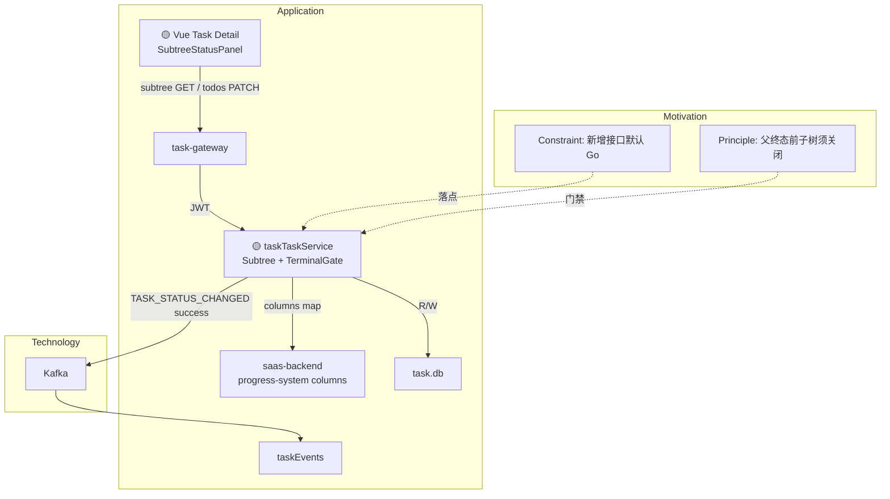
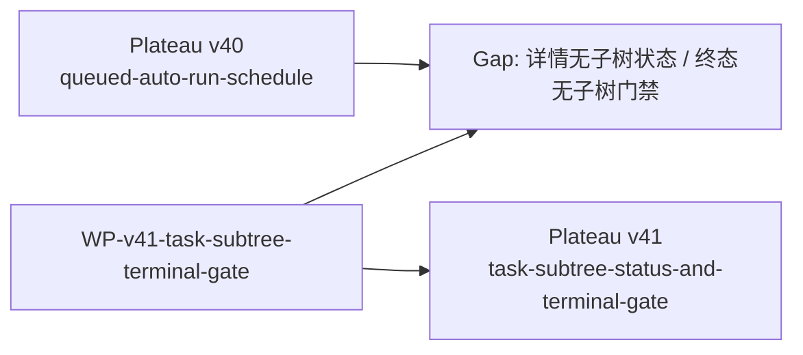

# Application Integration v41 — Task Subtree Status & Terminal Gate

```mermaid
flowchart TB
  subgraph Motivation
    goFirst["Constraint: 新增接口默认 Go"]
    subtreeAlign["Principle: 父终态前子树须关闭"]
  end

  subgraph Application
    vueTask["🟡 Vue Task Detail<br/>SubtreeStatusPanel"]
    gw["task-gateway"]
    tts["🟡 taskTaskService<br/>Subtree + TerminalGate"]
    django["saas-backend<br/>progress-system columns"]
    te["taskEvents"]
    taskDB["task.db"]
  end

  subgraph Technology
    kafka["Kafka"]
  end

  vueTask -->|subtree GET / todos PATCH| gw
  gw -->|JWT| tts
  tts -->|R/W| taskDB
  tts -->|columns map| django
  tts -->|TASK_STATUS_CHANGED success| kafka
  kafka --> te
  goFirst -.->|落点| tts
  subtreeAlign -.->|门禁| tts
```

## 架构变迁 v40→v41

```mermaid
flowchart LR
  p40["Plateau v40<br/>queued-auto-run-schedule"] --> gap["Gap: 详情无子树状态 / 终态无子树门禁"]
  wp["WP-v41-task-subtree-terminal-gate"] --> gap
  wp --> p41["Plateau v41<br/>task-subtree-status-and-terminal-gate"]
```
