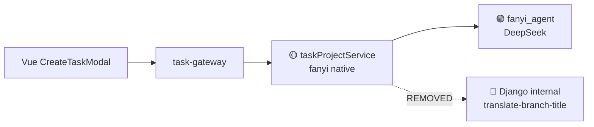
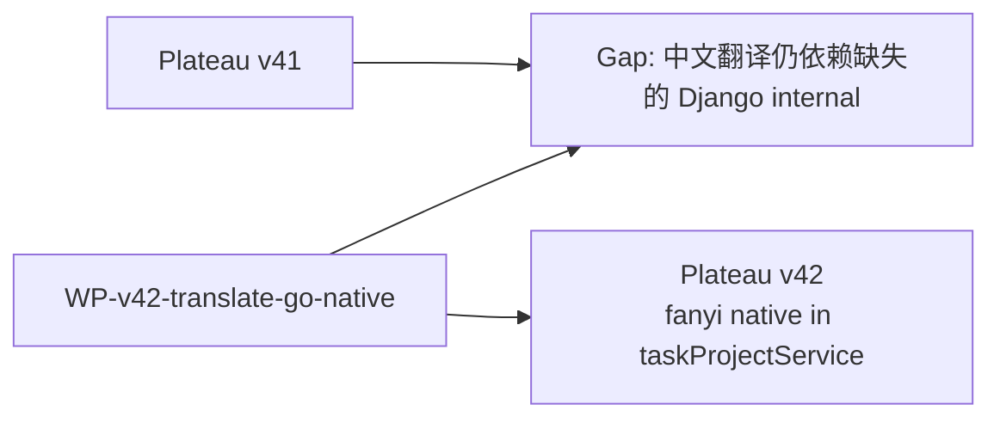

# Application Integration v42 — translate-branch-title Go native

```mermaid
flowchart LR
  Vue["Vue CreateTaskModal"] --> GW["task-gateway"]
  GW --> TPS["🟡 taskProjectService<br/>fanyi native"]
  TPS --> Fanyi["🟢 fanyi_agent<br/>DeepSeek"]
  TPS -.->|REMOVED| DJ["🔴 Django internal<br/>translate-branch-title"]
```

## 架构变迁 v41→v42

```mermaid
flowchart LR
  p41["Plateau v41"] --> gap["Gap: 中文翻译仍依赖缺失的 Django internal"]
  wp["WP-v42-translate-go-native"] --> gap
  wp --> p42["Plateau v42<br/>fanyi native in taskProjectService"]
```
