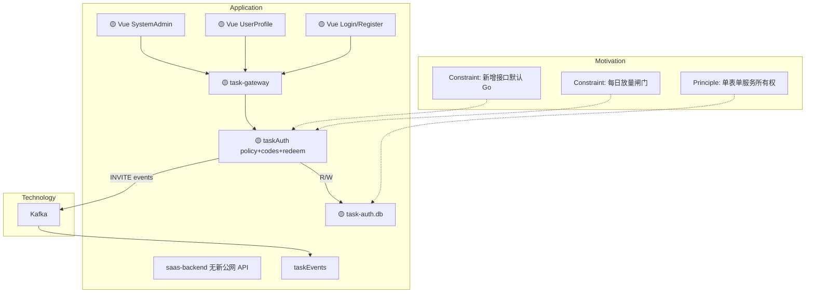
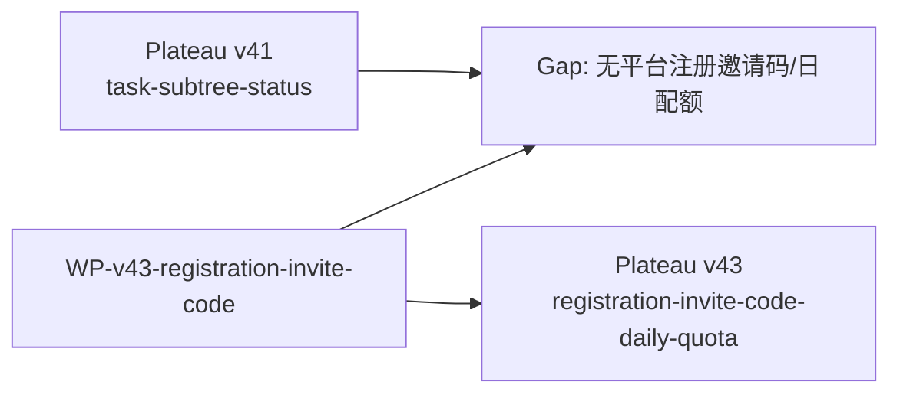

# Application Integration v43 — Registration Invite Code Daily Quota

```mermaid
flowchart TB
  subgraph Motivation
    goFirst["Constraint: 新增接口默认 Go"]
    singleOwner["Principle: 单表单服务所有权"]
    dailyCap["Constraint: 每日放量闸门"]
  end

  subgraph Application
    vueAdmin["🟡 Vue SystemAdmin"]
    vueProfile["🟡 Vue UserProfile"]
    vueAuth["🟡 Vue Login/Register"]
    gw["🟡 task-gateway"]
    taskAuth["🟡 taskAuth policy+codes+redeem"]
    django["saas-backend 无新公网 API"]
    te["taskEvents"]
    authDB["🟡 task-auth.db"]
  end

  subgraph Technology
    kafka["Kafka"]
  end

  vueAdmin --> gw
  vueProfile --> gw
  vueAuth --> gw
  gw --> taskAuth
  taskAuth -->|R/W| authDB
  taskAuth -->|INVITE events| kafka
  kafka --> te
  goFirst -.-> taskAuth
  singleOwner -.-> authDB
  dailyCap -.-> taskAuth
```

## 架构变迁 v41→v43

```mermaid
flowchart LR
  p41["Plateau v41<br/>task-subtree-status"] --> gap["Gap: 无平台注册邀请码/日配额"]
  wp["WP-v43-registration-invite-code"] --> gap
  wp --> p43["Plateau v43<br/>registration-invite-code-daily-quota"]
```
