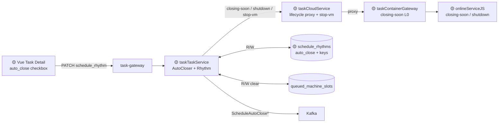

# Application Integration v44 — Schedule Rhythm Auto Close

```mermaid
flowchart LR
  vue["🟡 Vue Task Detail<br/>auto_close checkbox"]
  gw["task-gateway"]
  tts["🟡 taskTaskService<br/>AutoCloser + Rhythm"]
  tcs["🟡 taskCloudService<br/>lifecycle proxy + stop-vm"]
  cgw["🟡 taskContainerGateway<br/>closing-soon L0"]
  agent["🟡 onlineServiceJS<br/>closing-soon / shutdown"]
  rhythm[("🟡 schedule_rhythms<br/>auto_close + keys")]
  slots[("queued_machine_slots")]
  kafka["Kafka"]

  vue -->|PATCH schedule_rhythm| gw --> tts
  tts <-->|R/W| rhythm
  tts <-->|R/W clear| slots
  tts -->|closing-soon / shutdown / stop-vm| tcs
  tcs -->|proxy| cgw --> agent
  tts -->|ScheduleAutoClose*| kafka
```

- **状态**: 🎯 target
- **基于**: v41 current
- **迭代**: schedule-rhythm-auto-close
