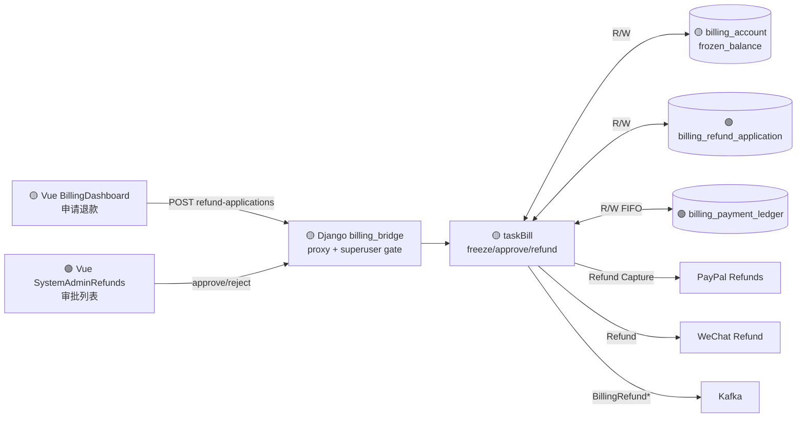

# Application Integration v45 — Tenant Refund Application

```mermaid
flowchart LR
  vueBill["🟡 Vue BillingDashboard<br/>申请退款"]
  vueAdmin["🟢 Vue SystemAdminRefunds<br/>审批列表"]
  django["🟡 Django billing_bridge<br/>proxy + superuser gate"]
  taskBill["🟡 taskBill<br/>freeze/approve/refund"]
  account[("🟡 billing_account<br/>frozen_balance")]
  refundApp[("🟢 billing_refund_application")]
  ledger[("🟢 billing_payment_ledger")]
  paypal["PayPal Refunds"]
  wechat["WeChat Refund"]
  kafka["Kafka"]

  vueBill -->|POST refund-applications| django
  vueAdmin -->|approve/reject| django
  django --> taskBill
  taskBill <-->|R/W| account
  taskBill <-->|R/W| refundApp
  taskBill <-->|R/W FIFO| ledger
  taskBill -->|Refund Capture| paypal
  taskBill -->|Refund| wechat
  taskBill -->|BillingRefund*| kafka
```

- **状态**: 🎯 target
- **基于**: v41 current
- **迭代**: tenant-refund-application
