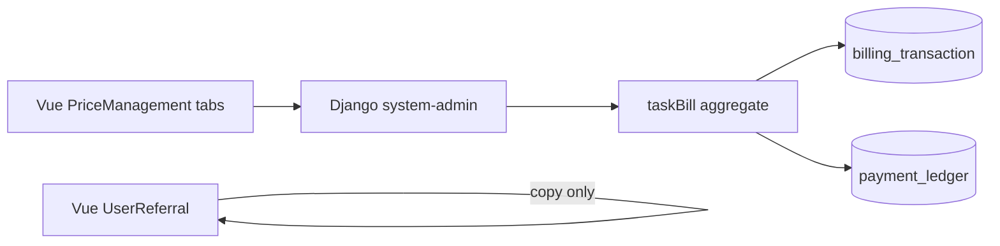
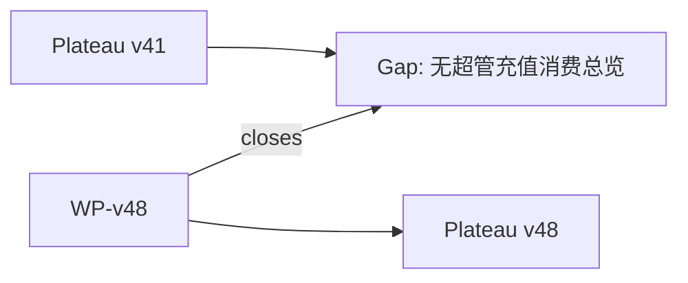

# v48 — Admin Recharge Consumption Overview

```mermaid
flowchart LR
  VU[Vue PriceManagement tabs] --> DJ[Django system-admin]
  DJ --> TB[taskBill aggregate]
  TB --> TX[(billing_transaction)]
  TB --> LG[(payment_ledger)]
  VR[Vue UserReferral] -->|copy only| VR
```

```mermaid
flowchart LR
  P41[Plateau v41] --> G[Gap: 无超管充值消费总览]
  WP[WP-v48] -->|closes| G
  WP --> P48[Plateau v48]
```
