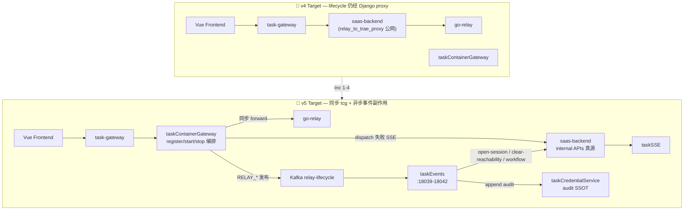
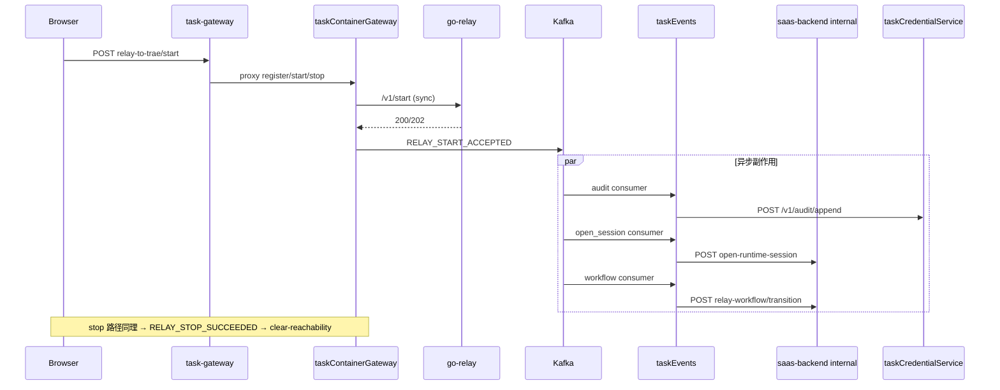
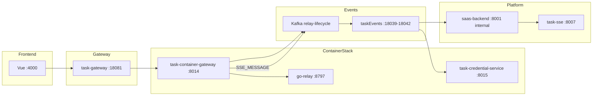

# Application Integration — v5 Target Architecture

> **状态**: 🎯 target | **版本**: v5 | **迭代**: relay lifecycle 公网绕 Django + 副作用事件消费者 | **基于**: v4  
> **设计日期**: 2026-07-05 17:00 | **交付**: 2026-07-05

## 架构变迁总览 (v4 → v5)

## Relay lifecycle 数据流

## 组件拓扑

## v5 变更明细

| 标记 | 组件/关系 | 说明 |
|------|-----------|------|
| 🟡 MOD | taskContainerGateway | relay register/start/stop 同步编排 + Kafka RELAY_* |
| 🟢 NEW | taskEvents relay-lifecycle | audit / open-session / clear-reachability / workflow |
| 🟢 NEW | Django internal APIs | open-runtime-session、clear-reachability、workflow、relay SSE |
| 🟡 MOD | taskCredentialService | POST /v1/audit/append（audit SSOT） |
| 🔴 DEP | relay_to_trae_proxy 公网 | 410 stub；`TASK_CONTAINER_GATEWAY_ENABLED=false` 回滚 |
