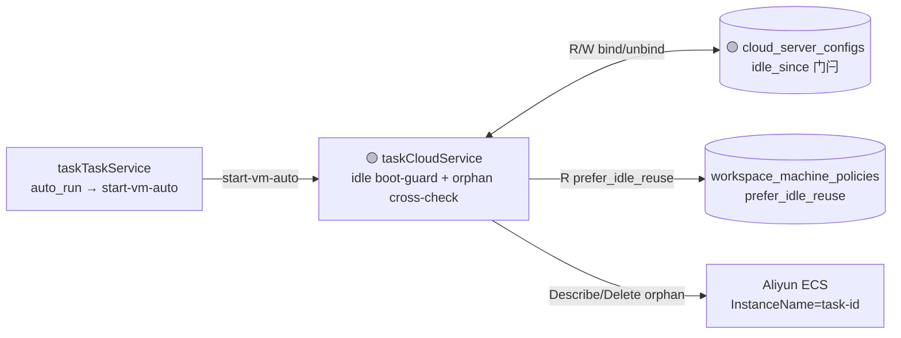

# Application Integration v50 — Idle Reuse Boot Guard + Orphan Cross-Check

```mermaid
flowchart LR
  tts["taskTaskService<br/>auto_run → start-vm-auto"]
  tcs["🟡 taskCloudService<br/>idle boot-guard + orphan cross-check"]
  csc[("🟡 cloud_server_configs<br/>idle_since 门闩")]
  policy[("workspace_machine_policies<br/>prefer_idle_reuse")]
  ecs["Aliyun ECS<br/>InstanceName=task-id"]

  tts -->|start-vm-auto| tcs
  tcs <-->|R/W bind/unbind| csc
  tcs -->|R prefer_idle_reuse| policy
  tcs -->|Describe/Delete orphan| ecs
```

- **状态**: 🎯 target
- **基于**: v48 current
- **迭代**: idle-reuse-boot-guard-orphan-cross-check
