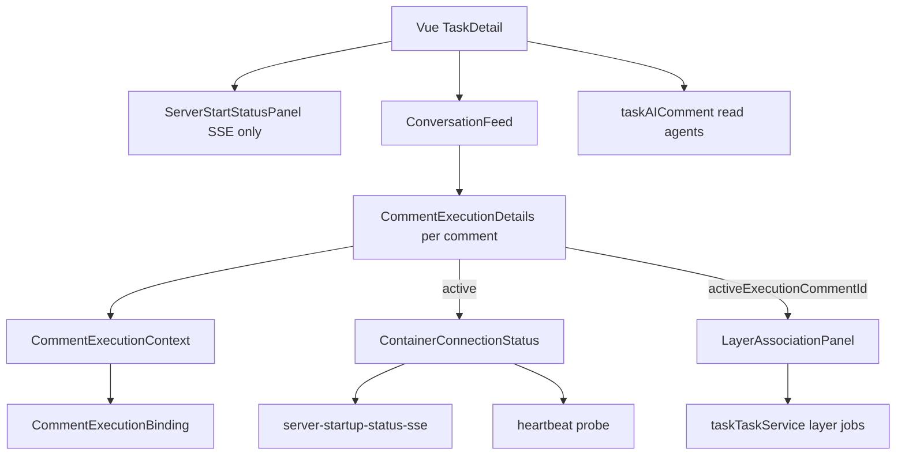
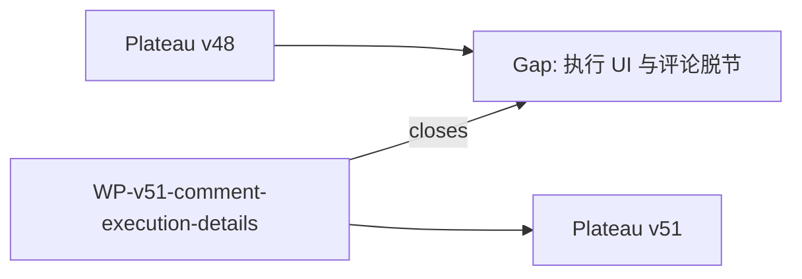

# v51 — Comment Execution Details

```mermaid
flowchart TB
  TD[Vue TaskDetail] --> RT[ServerStartStatusPanel SSE only]
  TD --> Feed[ConversationFeed]
  Feed --> ED[CommentExecutionDetails per comment]
  ED --> CTX[CommentExecutionContext]
  ED -->|active| CCS[ContainerConnectionStatus]
  ED -->|activeExecutionCommentId| LAP[LayerAssociationPanel]
  CCS --> SSE[server-startup-status-sse]
  CCS --> HB[heartbeat probe]
  LAP --> TTS[taskTaskService layer jobs]
  TD --> TAC[taskAIComment read agents]
  CTX --> BIND[CommentExecutionBinding]
```

```mermaid
flowchart LR
  P48[Plateau v48] --> G[Gap: 执行 UI 与评论脱节]
  WP[WP-v51-comment-execution-details] -->|closes| G
  WP --> P51[Plateau v51]
```
