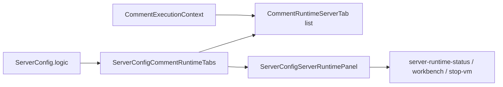

# v52 Application Integration — Comment Runtime Server Tabs

```mermaid
flowchart LR
  CTX[CommentExecutionContext] --> TABS[CommentRuntimeServerTab list]
  SC[ServerConfig.logic] --> CRT[ServerConfigCommentRuntimeTabs]
  CRT --> TABS
  CRT --> PANEL[ServerConfigServerRuntimePanel]
  PANEL --> API[server-runtime-status / workbench / stop-vm]
```

MVP：多 Tab 共享任务级实例；独立容器见 OPT-20260722-038。
