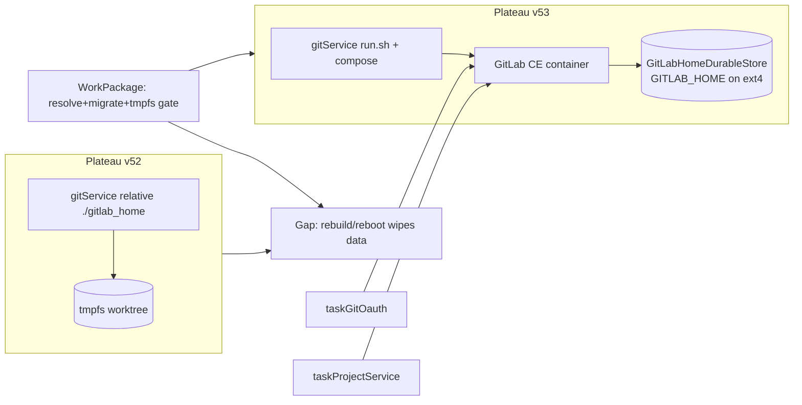

# v53 Application Integration — Durable GitLab Home

```mermaid
flowchart LR
  subgraph Plateau_v52["Plateau v52"]
    GS_old[gitService relative ./gitlab_home]
    TMP[(tmpfs worktree)]
    GS_old --> TMP
  end

  Gap[Gap: rebuild/reboot wipes data]

  subgraph Plateau_v53["Plateau v53"]
    GS[gitService run.sh + compose]
    GL[GitLab CE container]
    STORE[(GitLabHomeDurableStore\nGITLAB_HOME on ext4)]
    GS --> GL
    GL --> STORE
  end

  WP[WorkPackage: resolve+migrate+tmpfs gate]

  Plateau_v52 --> Gap
  WP --> Gap
  WP --> Plateau_v53

  OAuth[taskGitOauth] --> GL
  Proj[taskProjectService] --> GL
```
