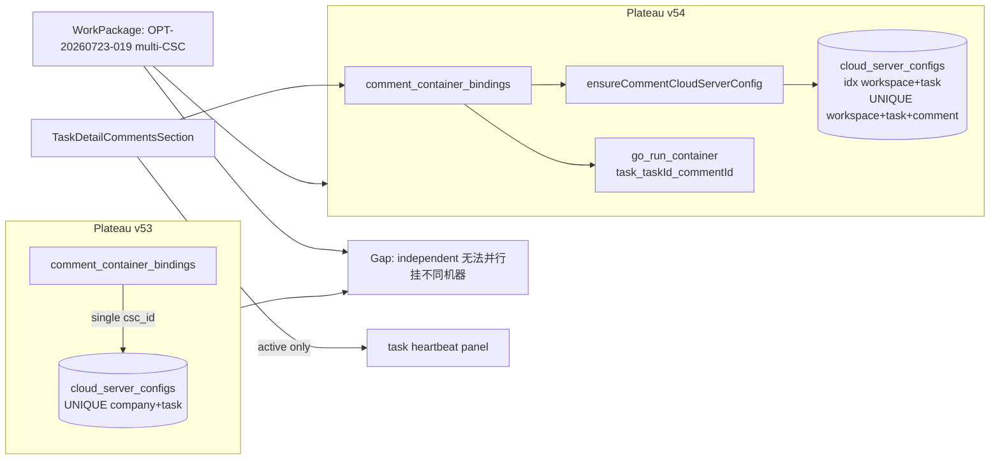

# v54 Application Integration — Comment Multi-CSC Parallel

```mermaid
flowchart LR
  subgraph Plateau_v53["Plateau v53"]
    CCB_old[comment_container_bindings]
    CSC_old[(cloud_server_configs\nUNIQUE company+task)]
    CCB_old -->|single csc_id| CSC_old
  end

  Gap[Gap: independent 无法并行挂不同机器]

  subgraph Plateau_v54["Plateau v54"]
    CCB[comment_container_bindings]
    ENS[ensureCommentCloudServerConfig]
    CSC[(cloud_server_configs\nidx workspace+task\nUNIQUE workspace+task+comment)]
    MOCK[go_run_container\ntask_taskId_commentId]
    CCB --> ENS
    ENS --> CSC
    CCB --> MOCK
  end

  WP[WorkPackage: OPT-20260723-019 multi-CSC]

  Plateau_v53 --> Gap
  WP --> Gap
  WP --> Plateau_v54

  FE[TaskDetailCommentsSection] --> CCB
  FE -->|active only| HB[task heartbeat panel]
```
