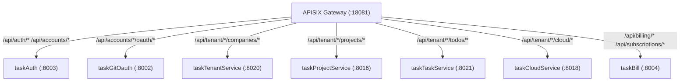

# v56 Application Integration — Django→Go Final Migration

> **版本:** v56 🎯 target | **迭代:** django-final-go-migration  
> **作者:** claude | **日期:** 2026-07-29 16:45  
> **基于:** v55 (v55-application-integration-20260728-1538-claude)

## 架构变迁视图

```mermaid
graph TD;
  p55["Plateau v55 (current) — Django 仍在"]
  p56["Plateau v56 (target) — Django 退役"]
  django55["Django saas-backend (:8001)"]
  task-auth["taskAuth (:8003) — users, profiles, SSO, session"]
  task-gitoauth["taskGitOauth (:8002) — git identities, OAuth"]
  task-tenant["taskTenantService (:8020) — companies, members, groups"]
  task-project["taskProjectService (:8016) — projects, workspaces, ACL"]
  task-task["taskTaskService (:8021) — todos CRUD"]
  task-aicomment["taskAIComment (:8022) — comment import"]
  task-cloud["taskCloudService (:8018) — platforms, VPC, images, feature-params"]
  task-bill["taskBill (:8004) — billing, subscriptions, pricing, refund"]
  task-events-go["taskEvents (:8023) — Kafka consumers, SSE dispatch"]
  kafka-consumers["Kafka Consumers (Go) — 16 intent handlers"]
  gateway["APISIX Gateway (:18081)"]
  kafka-broker["Kafka — Domain Events Bus"]
  django-depr["Django saas-backend [DEPRECATED v56]"]
  aiprovider-depr["Saas_Ai_Provider Django [DEPRECATED v56]"]
  gap-deadcode["Gap 1: ai-provider Django 死代码 (97 files)"]
  gap-intents["Gap 2: Kafka→Django HTTP 回环 (16 intents)"]
  gap-internal["Gap 3: Go 依赖 Django internal API"]
  gap-cloud["Gap 4: 云平台配置仍 Django (425 files)"]
  gap-billing["Gap 5: 计费桥接经 Django 代理"]
  gap-admin["Gap 6: 系统管理面 Django"]
  gap-core["Gap 7: accounts+projects 核心域"]
  wp1["WP1: Phase 1 — 死代码清理 (1-2d)"]
  wp2["WP2: Phase 2 — 事件意图 Kafka 化 (1-2w)"]
  wp3["WP3: Phase 3 — Internal API 迁出 (2-4w)"]
  wp4["WP4: Phase 4 — 云平台迁 taskCloud (2-4w)"]
  wp5["WP5: Phase 5 — 计费桥接清理 (1w)"]
  wp6["WP6: Phase 6 — 管理面迁移 (1w)"]
  wp7["WP7: Phase 7 — 核心域迁移 (4-8w)"]
  wp8["WP8: Phase 8 — Django 退役 (1w)"]
  p55 --> gap-deadcode
  p55 --> gap-intents
  p55 --> gap-internal
  p55 --> gap-cloud
  p55 --> gap-billing
  p55 --> gap-admin
  p55 --> gap-core
  wp1 --|> gap-deadcode
  wp2 --|> gap-intents
  wp3 --|> gap-internal
  wp4 --|> gap-cloud
  wp5 --|> gap-billing
  wp6 --|> gap-admin
  wp7 --|> gap-core
  wp1 --|> p56
  wp2 --|> p56
  wp3 --|> p56
  wp4 --|> p56
  wp5 --|> p56
  wp6 --|> p56
  wp7 --|> p56
  wp8 --|> p56
```

## v56 Target 数据流



## 变更明细

| 标记 | 元素 | 说明 |
|------|------|------|
| 🔴 [DEPRECATED] | Django saas-backend | 8 Phase 逐步退役，最终删除 task2app/ |
| 🔴 [DEPRECATED] | Saas_Ai_Provider Django | 死代码清理 (Phase 1) |
| 🟢 [NEW] | Kafka Consumers (Go) | 16 intent handlers 替代 Kafka→Django HTTP 回环 |
| 🟡 [MODIFIED] | taskAuth | 接管 users CRUD, profiles, SSO bridge, session store |
| 🟡 [MODIFIED] | taskGitOauth | 接管 git identities store |
| 🟡 [MODIFIED] | taskTenantService | 接管 companies, members, groups, workspace-access |
| 🟡 [MODIFIED] | taskProjectService | 接管 projects CRUD, deliverable/progress, ACL |
| 🟡 [MODIFIED] | taskTaskService | 接管 todos CRUD |
| 🟡 [MODIFIED] | taskAIComment | 接管 comment import 直写 |
| 🟡 [MODIFIED] | taskCloudService | 接管 platforms, VPC, images, feature-params 全量 |
| 🟡 [MODIFIED] | taskBill | 接管 APISIX 直连, 订阅/支付, pricing, refund |
| 🟡 [MODIFIED] | taskEvents | 接管 Kafka consumers + SSE dispatch |
