# v57 Application Integration — Django 完全退役，纯 Go 微服务

> **版本:** v57 🟢 current | **迭代:** django-retired-final  
> **作者:** claude | **日期:** 2026-07-30 02:29  
> **基于:** v56 (v56-application-integration-20260729-1645-claude) — 8 Phase 全部完成

## 架构变迁摘要

v55 (current) → v56 (target, Django 退役路线图) → **v57 (current, Django 已完全移除)**

v56 制定的 8 Phase Strangler Fig 迁移全部完成：
- Phase 1 ✅ 死代码清理
- Phase 2 ✅ 事件意图 Kafka 化
- Phase 3 ✅ Internal API 迁出
- Phase 4 ✅ 云平台迁 taskCloudService
- Phase 5 ✅ 计费桥接清理
- Phase 6 ✅ 管理面迁移
- Phase 7 ✅ 核心域迁移
- Phase 8 ✅ Django 退役（进程下线、路由清理、DB registry 更新）

## v57 Current 服务拓扑

```mermaid
graph TD;
  gateway["APISIX Gateway (:18081)"]

  task-auth["taskAuth (:8003)\nusers, profiles, SSO, sessions"]
  task-gitoauth["taskGitOauth (:8002)\ngit identities, OAuth tokens"]
  task-tenant["taskTenantService (:8020)\ncompanies, members, groups"]
  task-project["taskProjectService (:8016)\nprojects, workspaces, ACL, GitLab"]
  task-task["taskTaskService (:8021)\ntodos CRUD"]
  task-aicomment["taskAIComment (:8022)\ncomment import"]
  task-cloud["taskCloudService (:8018)\nplatforms, VPC, images, regions, OAuth, CSC"]
  task-bill["taskBill (:8004)\nbilling, subscriptions, pricing, refund"]
  task-events["taskEvents (:8023)\nKafka consumers, SSE dispatch"]

  kafka["Kafka — Domain Events Bus"]
  kafka-consumers["Kafka Consumers (Go)\n16 intent handlers"]

  gateway -->|"/api/auth/* /api/accounts/*"| task-auth
  gateway -->|"/api/accounts/*/oauth/*"| task-gitoauth
  gateway -->|"/api/tenant/*/companies/*"| task-tenant
  gateway -->|"/api/tenant/*/projects/*"| task-project
  gateway -->|"/api/tenant/*/todos/* /api/tasks/*"| task-task
  gateway -->|"/api/tenant/*/ai-comments/*"| task-aicomment
  gateway -->|"/api/tenant/*/cloud/* /api/system-admin/*"| task-cloud
  gateway -->|"/api/billing/* /api/system-admin/resource-pricing/*"| task-bill

  kafka -->|"consume domain events"| kafka-consumers
  kafka-consumers -->|"company/user events"| task-tenant
  kafka-consumers -->|"profile events"| task-auth
  kafka-consumers -->|"workspace/deliverable events"| task-project
  kafka-consumers -->|"cloud/IAM/feature-params events"| task-cloud
  kafka-consumers -->|"SSE dispatch"| task-events
```

## 变更明细

| 标记 | 元素 | 说明 |
|------|------|------|
| 🟢 [CURRENT] | APISIX Gateway | 全部路由指向 Go 服务，零 Django upstream |
| 🟢 [CURRENT] | taskAuth | users CRUD, profiles, SSO/OIDC bridge, session store, logout |
| 🟢 [CURRENT] | taskGitOauth | git identities store, GitHub/GitLab OAuth flow |
| 🟢 [CURRENT] | taskTenantService | companies CRUD, members, groups, workspace-access |
| 🟢 [CURRENT] | taskProjectService | projects CRUD, workspaces, deliverable/progress, GitLab 集成 |
| 🟢 [CURRENT] | taskTaskService | todos CRUD, task field validation |
| 🟢 [CURRENT] | taskAIComment | comment import 直写 |
| 🟢 [CURRENT] | taskCloudService | platforms, VPC/VSwitch/SG, images, regions, aliyun OAuth, CSC, feature-params |
| 🟢 [CURRENT] | taskBill | APISIX 直连, 订阅/支付, pricing, refund |
| 🟢 [CURRENT] | taskEvents | 16 intent Kafka consumers + SSE realtime dispatch |
| 🔴 [REMOVED] | Django saas-backend | 进程已下线，runAll.yaml 已注释，task2app/ 待清理 |
| 🔴 [REMOVED] | Saas_Ai_Provider Django | 死代码已清理 |

## 数据所有权

| Database | Owner Service | Key Tables |
|----------|--------------|------------|
| taskAuth DB | taskAuth | users, profiles, oauth_tokens, oidc_clients, sessions |
| taskGitOauth DB | taskGitOauth | git_identities, oauth_tokens |
| taskTenant DB | taskTenantService | companies, members, groups, tenant_options |
| taskProject DB | taskProjectService | projects, workspaces, workspace_access, deliverables, progress_systems |
| taskTask DB | taskTaskService | todos, task_fields |
| taskAIComment DB | taskAIComment | ai_comments |
| taskCloud DB | taskCloudService | cloud_platforms, cloud_server_configs, cloud_server_events, instance_types |
| taskBill DB | taskBill | billing_accounts, subscriptions, pricing_packages, refund_applications |
| **saas DB** | **[RETIRED]** | 所有数据已迁至各 Go 服务 MySQL |
