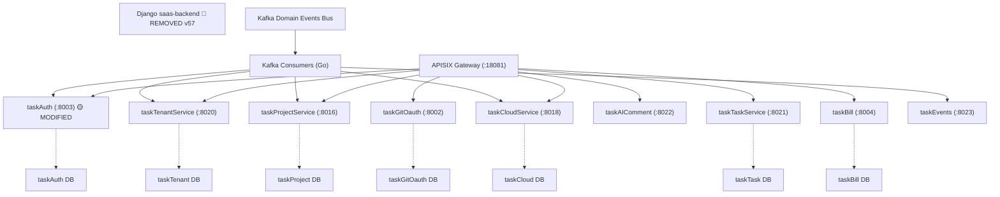

# v58 Application Integration — 邮箱邀请增强

> 🟡 [MODIFIED] taskAuth — 新增 invite_reason / account_expires_at / assigned_role 字段 + GET list 返回 inviterName

## 变更说明

- **版本**: v58 🎯 target
- **迭代**: email-invite-enhancement
- **日期**: 2026-08-03 12:00
- **变更**: taskAuth 组件修改 — 邮箱邀请新增 3 个字段 + 邀请人姓名
- **基于**: v57 (v57-application-integration-20260730-0229-claude.puml)
