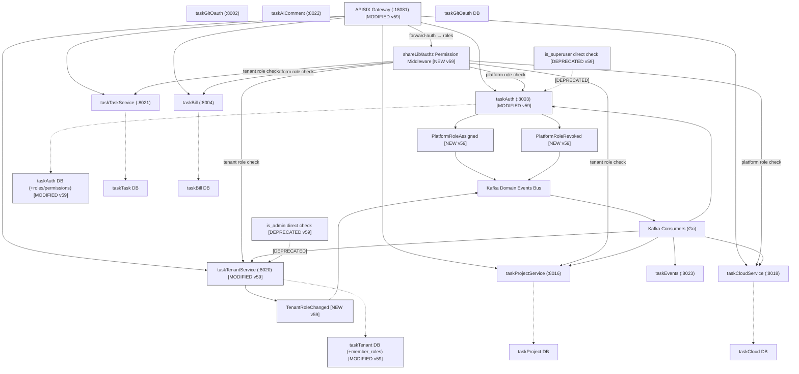

# v59 Application Integration — 身份角色权限体系

> ArchiMate Mermaid 渲染 | 版本: v59 target | 迭代: identity-role-permission-system | 作者: claude | 2026-08-04 14:00

## 变更图例

| 标记 | 含义 | 元素 |
|------|------|------|
| 🟢 [NEW v59] | 本次新增 | shareLibAuthz, evtRoleAssigned, evtRoleRevoked, evtTenantRole |
| 🟡 [MODIFIED v59] | 本次修改 | taskAuth, taskTenant, gateway, taskAuthDB, taskTenantDB |
| 🔴 [DEPRECATED v59] | 本次废弃 | oldIsAdmin, oldIsSuperuser |

## 关键数据流

1. **Gateway → shareLibAuthz**: forward-auth 注入 X-User-Roles + X-User-Permissions
2. **shareLibAuthz → Services**: 统一权限检查中间件（platform/tenant role check）
3. **taskAuth → Kafka**: 平台角色变更事件（PlatformRoleAssigned/Revoked）
4. **taskTenant → Kafka**: 租户角色变更事件（TenantRoleChanged）
