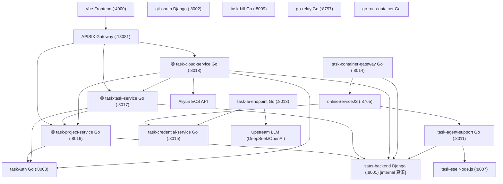

# v6 Application Integration — Mermaid Diagram

> 架构版本: v6 🎯 target | 作者: claude | 日期: 2026-07-06 15:43
> 迭代: Django 项目/任务/阿里云接口 → 3 个 Go 服务拆分

## v6 新增数据流

| 数据流 | 说明 |
|--------|------|
| GW → TPS | 项目/工作空间 API 路由 |
| GW → TTS | 任务/评论 API 路由 |
| GW → TCS | 云平台 API 路由 |
| TPS/TTS/TCS → AUTH | JWT 验证 |
| TPS/TTS/TCS → BE | company 存在性校验 (Django internal) |
| TTS → TPS | workspace 存在性校验 |
| TCS → TPS | workspace 默认配置 |
| TCS → TTS | 实例状态回调 |
| TCS → ALI | ECS/VPC API (aliyun-sdk-go) |

## 变更图例

| 标记 | 含义 |
|------|------|
| 🟢 TPS/TTS/TCS | [NEW v6] 新增 3 个 Go 服务 |
| 🟡 BE | [MODIFIED v6] Django 瘦身 |
| 🔴 (已移除) | [DEPRECATED v6] Django views/provider |
