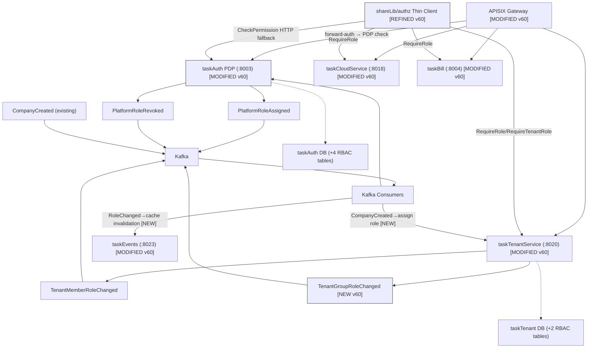

# v60 — RBAC 集中授权架构

> ArchiMate Mermaid | v60 target | rbac-v3 | claude | 2026-08-04

## Key Changes (v60 vs v59)

| Change | Detail |
|--------|--------|
| 🔄 REFINED | shareLib/authz: heavy engine → thin client (Context read O(1) + HTTP fallback to PDP) |
| 🟢 NEW | taskAuth PDP: `/api/internal/authz/check` centralized decision point |
| 🟢 NEW | tenant_group_role table: group → role inheritance |
| 🟢 NEW | CompanyCreated consumer: auto-assign tenant_admin to creator |
| 🟢 NEW | TenantGroupRoleChanged event |
| 🟡 MODIFIED | Phase 1: 8-14 days → 5-7 days (simplified scope) |
