# v63 — RBAC 综合设计：自定义角色 + 小组资源分配

> ArchiMate Mermaid | v63 target | rbac-merged-v63 | claude | 2026-08-05

```mermaid
graph TD;
  taskAuth["taskAuth PDP (:8003) [MODIFIED v63]"];
  taskTenant["taskTenantService (:8020) [MODIFIED v63]"];
  taskCloud["taskCloudService (:8018) [MODIFIED v63]"];
  taskBill["taskBill (:8004) [MODIFIED v63]"];
  taskProject["taskProjectService (:8016) [MODIFIED v63]"];
  taskTask["taskTaskService (:8021) [MODIFIED v63]"];
  taskEvents["taskEvents (:8023) [MODIFIED v63]"];
  taskFE["taskFE (SPA) [NEW v63]"];
  shareLibAuthz["shareLib/authz Thin Client [MODIFIED v63]"];
  gateway["APISIX Gateway [MODIFIED v63]"];
  kafkaBroker["Kafka"];
  kafkaConsumers["Kafka Consumers"];
  taskAuthDB["taskAuth DB (+4 RBAC tables, company_id)"];
  taskTenantDB["taskTenant DB (+4: member_role/group_role/group_admin/resource_assignment)"];
  evtRoleChanged["RoleChanged [NEW v63]"];
  evtTenantRole["TenantMemberRoleChanged"];
  evtGroupRole["TenantGroupRoleChanged"];
  evtGroupAdmin["GroupAdminAssigned/Revoked [NEW v63]"];
  evtResAssign["ResourceAssigned/RevokedFromGroup [NEW v63]"];
  evtGroupMember["MemberAdded/RemovedFromGroup [NEW v63]"];
  evtCompanyCreated["CompanyCreated (existing)"];
  evtMemberAdded["CompanyMemberAdded (existing)"];
  oldIsAdmin["is_admin/is_superuser direct check [DEPRECATED]"];
  oldPolicy["policy.go creator hardcode [DEPRECATED]"];
  oldRequireRole["RequireRole priority check [DEPRECATED]"];

  %% Gateway → PDP (forward-auth, X-Tenant-Perms injection)
  gateway -->|"forward-auth → PDP ← X-User-Roles, X-Tenant-Perms"| taskAuth;
  gateway --> taskTenant;
  gateway --> taskProject;
  gateway --> taskTask;
  gateway --> taskCloud;
  gateway --> taskBill;
  gateway -->|"SPA static assets"| taskFE;

  %% Thin client serves services (permission-code driven + group resource inheritance)
  shareLibAuthz -->|"CheckPerm HTTP fallback"| taskAuth;
  shareLibAuthz -->|"RequirePerm(member:*) + RequireGroupAdmin"| taskTenant;
  shareLibAuthz -->|"RequirePerm(cloud:*) + 组资源继承"| taskCloud;
  shareLibAuthz -->|"RequirePerm(billing:*)"| taskBill;
  shareLibAuthz -->|"RequirePerm(project:*) + 组资源继承"| taskProject;
  shareLibAuthz -->|"RequirePerm(task:*) + 组资源继承"| taskTask;

  %% Kafka flow
  kafkaBroker --> kafkaConsumers;
  kafkaConsumers -->|"+CompanyCreated→tenant_admin, +MemberAdded→member"| taskTenant;
  kafkaConsumers --> taskAuth;
  kafkaConsumers --> taskProject;
  kafkaConsumers --> taskCloud;
  kafkaConsumers -->|"+RoleChanged/组事件→失效"| taskEvents;

  %% Data ownership
  taskAuth ..-> taskAuthDB;
  taskTenant ..-> taskTenantDB;
  taskProject ..-> taskProjectDB;
  taskTask ..-> taskTaskDB;
  taskCloud ..-> taskCloudDB;
  taskBill ..-> taskBillDB;

  %% Events
  taskAuth --> evtRoleChanged --> kafkaBroker;
  taskTenant --> evtTenantRole --> kafkaBroker;
  taskTenant --> evtGroupRole --> kafkaBroker;
  taskTenant --> evtGroupAdmin --> kafkaBroker;
  taskTenant --> evtResAssign --> kafkaBroker;
  taskTenant --> evtGroupMember --> kafkaBroker;
  evtCompanyCreated --> kafkaBroker;
  evtMemberAdded --> kafkaBroker;

  %% Deprecated
  oldIsAdmin -.->|"hard switch off"| taskAuth;
  oldIsAdmin -.-> taskTenant;
  oldPolicy -.-> taskTenant;
  oldRequireRole -.-> shareLibAuthz;

  style taskAuth fill:#LightYellow,stroke:#333
  style shareLibAuthz fill:#LightYellow,stroke:#333
  style taskFE fill:#LightGreen,stroke:#333
  style evtRoleChanged fill:#LightGreen,stroke:#333
  style evtGroupAdmin fill:#LightGreen,stroke:#333
  style evtResAssign fill:#LightGreen,stroke:#333
  style evtGroupMember fill:#LightGreen,stroke:#333
  style oldIsAdmin fill:#LightPink,stroke:#333
  style oldPolicy fill:#LightPink,stroke:#333
  style oldRequireRole fill:#LightPink,stroke:#333
```



## Key Changes (v63 merged design)

| Change | Source line | Detail |
|--------|-------------|--------|
| 🟢 NEW | custom-role line | Tenant-scoped **custom roles** (auth_role.company_id) — pick from 17 tenant perm codes |
| 🟡 MODIFIED | custom-role line | Authz judgment: RequireRole → **RequirePerm** (permission-code set, O(1) Context read) |
| 🟢 NEW | v62 line (kept) | **group_admin** role + tenant_group_admin + tenant_resource_group_assignment (project/cloud/task → group, view/manage) |
| 🟢 NEW | v62 line (kept) | 6 group/resource events (GroupAdminAssigned/Revoked, ResourceAssigned/RevokedFromGroup, MemberAdded/RemovedFromGroup) |
| 🟡 MODIFIED | merged | Resource access = RequirePerm OR HasGroupResourceAccess (group inheritance branch) |
| 🟢 NEW | custom-role line | taskFE frontend adoption (usePermissions, 37 sites) |
| 🔴 DEPRECATED | custom-role line | is_admin/is_superuser direct authz — **hard switch**; policy.go creator hardcode; RequireRole priority |

## Migration View (v62 → v63)

```
Plateau v62 (fixed roles + group_admin + resource→group, role-priority authz)
  → Gap (no custom roles, no perm-code authz, is_admin remains)
  → WP1 (shareLib/authz RequirePerm + PDP perm-set + custom role CRUD + group roles, D1-D4)
  → WP2 (APISIX X-Tenant-Perms + taskFE 37 sites + hard-switch backfill, D5-D8)
  → WP3 (v62 group/resource APIs + events integrated into perm model, D3-D4 merged)
  → Plateau v63 (custom roles + perm-code authz + group resource + hard switch)
```
