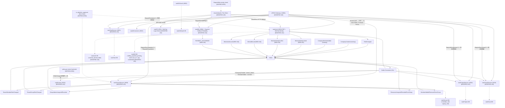

# v64 — 微信身份统一设计：跨应用 openid/unionid + 绑定 + 支付回调可靠性

> ArchiMate Mermaid | v64 target | wechat-login-openid-unionid | claude | 2026-08-05

```mermaid
graph TD;
  taskAuth["taskAuth (:8003) PDP + WeChat Identity [MODIFIED v64]"];
  taskGitOauth["taskGitOauth (:8002)"];
  taskTenant["taskTenantService (:8020) [MODIFIED v63]"];
  taskProject["taskProjectService (:8016) [MODIFIED v63]"];
  taskTask["taskTaskService (:8021) [MODIFIED v63]"];
  taskAIComment["taskAIComment (:8022)"];
  taskCloud["taskCloudService (:8018) [MODIFIED v63]"];
  taskBill["taskBill (:8004) + Payment Callback Reliability [MODIFIED v64]"];
  taskEvents["taskEvents (:8023) [MODIFIED v63]"];
  taskFE["taskFE (SPA) + WeChat Login Entries [MODIFIED v64]"];
  shareLibAuthz["shareLib/authz Thin Client [MODIFIED v63]"];
  kafkaConsumers["Kafka Consumers (Go)"];
  gateway["APISIX Gateway (:18081) [MODIFIED v63]"];
  kafkaBroker["Kafka"];
  taskAuthDB["taskAuth DB (+wechat_identity table) [MODIFIED v64]"];
  taskGitOauthDB["taskGitOauth DB"];
  taskTenantDB["taskTenant DB (+member_role +group_role)"];
  taskProjectDB["taskProject DB"];
  taskTaskDB["taskTask DB"];
  taskCloudDB["taskCloud DB"];
  taskBillDB["taskBill DB (+billing_payment_pending, order user_id + pay credentials) [MODIFIED v64]"];
  evtRoleChanged["RoleChanged"];
  evtTenantRole["TenantMemberRoleChanged"];
  evtGroupRole["TenantGroupRoleChanged"];
  evtGroupAdmin["GroupAdminAssigned/Revoked"];
  evtResAssign["ResourceAssigned/RevokedFromGroup"];
  evtGroupMember["MemberAdded/RemovedFromGroup"];
  evtCompanyCreated["CompanyCreated (existing)"];
  evtMemberAdded["CompanyMemberAdded (existing)"];
  evtWxLinked["WechatIdentityLinked [NEW v64]"];
  evtWxConflict["WechatIdentityConflict [NEW v64]"];
  evtWxBound["WechatBound [NEW v64]"];
  evtWxUnbound["WechatUnbound [NEW v64]"];
  evtPaySucceeded["PAYMENT_SUCCEEDED [NEW v64]"];
  oldIsAdmin["is_admin/is_superuser direct check [DEPRECATED]"];
  oldPolicy["policy.go creator hardcode [DEPRECATED]"];
  oldRequireRole["RequireRole priority check [DEPRECATED]"];

  %% Gateway → PDP (forward-auth, X-Tenant-Perms injection)
  gateway -->|"forward-auth → PDP ← X-User-Roles, X-Tenant-Perms"| taskAuth;
  gateway --> taskTenant;
  gateway --> taskProject;
  gateway --> taskTask;
  gateway --> taskAIComment;
  gateway --> taskCloud;
  gateway --> taskBill;
  gateway -->|"SPA static assets"| taskFE;

  %% Thin client serves services (permission-code driven + group resource inheritance)
  shareLibAuthz -->|"CheckPerm HTTP fallback"| taskAuth;
  shareLibAuthz -->|"RequirePerm(member:*) + RequireGroupAdmin"| taskTenant;
  shareLibAuthz -->|"RequirePerm(cloud:*) + 组资源继承"| taskCloud;
  shareLibAuthz -->|"RequirePerm(billing:*)"| taskBill;
  shareLibAuthz -->|"RequirePerm(project:*) + 组资源继承"| taskProject;
  shareLibAuthz -->|"RequirePerm(task:*) + 组资源继承"| taskTask;

  %% Kafka flow
  kafkaBroker --> kafkaConsumers;
  kafkaConsumers -->|"+CompanyCreated→tenant_admin, +MemberAdded→member"| taskTenant;
  kafkaConsumers --> taskAuth;
  kafkaConsumers --> taskProject;
  kafkaConsumers --> taskCloud;
  kafkaConsumers -->|"+RoleChanged/组事件→失效"| taskEvents;

  %% Data ownership
  taskAuth ..-> taskAuthDB;
  taskGitOauth ..-> taskGitOauthDB;
  taskTenant ..-> taskTenantDB;
  taskProject ..-> taskProjectDB;
  taskTask ..-> taskTaskDB;
  taskCloud ..-> taskCloudDB;
  taskBill ..-> taskBillDB;

  %% v64 支付回调可靠性（登录/支付解耦 — 无身份核对）
  %% Events (v63 base)
  taskAuth --> evtRoleChanged --> kafkaBroker;
  taskTenant --> evtTenantRole --> kafkaBroker;
  taskTenant --> evtGroupRole --> kafkaBroker;
  taskTenant --> evtGroupAdmin --> kafkaBroker;
  taskTenant --> evtResAssign --> kafkaBroker;
  taskTenant --> evtGroupMember --> kafkaBroker;
  evtCompanyCreated --> kafkaBroker;
  evtMemberAdded --> kafkaBroker;

  %% Events (v64 new)
  taskAuth --> evtWxLinked --> kafkaBroker;
  taskAuth --> evtWxConflict --> kafkaBroker;
  taskAuth --> evtWxBound --> kafkaBroker;
  taskAuth --> evtWxUnbound --> kafkaBroker;
  taskBill --> evtPaySucceeded --> kafkaBroker;

  %% Deprecated
  oldIsAdmin -.-> taskAuth;
  oldIsAdmin -.-> taskTenant;
  oldPolicy -.-> taskTenant;
  oldRequireRole -.-> shareLibAuthz;
```
