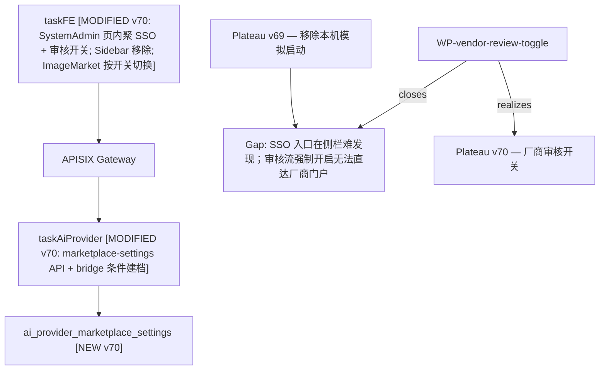

# v70 Application Integration — 厂商申请审核开关 + SSO 入口内聚 (Target, 2026-08-10 19:55)

```mermaid
graph TD;
  taskFE["taskFE [MODIFIED v70: SystemAdmin 页内聚 SSO + 审核开关; Sidebar 移除; ImageMarket 按开关切换]"]
  gateway["APISIX Gateway"]
  taskAiProvider["taskAiProvider [MODIFIED v70: marketplace-settings API + bridge 条件建档]"]
  mktSettings["ai_provider_marketplace_settings [NEW v70]"]
  plateauV69["Plateau v69 — 移除本机模拟启动"]
  plateauV70["Plateau v70 — 厂商审核开关"]
  gap["Gap: SSO 入口在侧栏难发现；审核流强制开启无法直达厂商门户"]
  wp["WP-vendor-review-toggle"]

  taskFE --> gateway
  gateway --> taskAiProvider
  taskAiProvider --> mktSettings
  plateauV69 --> gap
  wp -->|closes| gap
  wp -->|realizes| plateauV70
```
