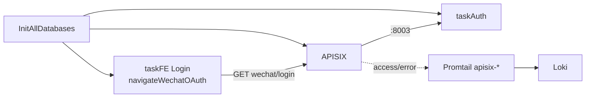

# application-integration v71 — wechat-login-apisix-502-hardening

```mermaid
flowchart LR
  FE[taskFE Login<br/>navigateWechatOAuth] -->|GET wechat/login| GW[APISIX]
  GW -->|:8003| AUTH[taskAuth]
  GW -.->|access/error| PT[Promtail apisix-*]
  PT --> LOKI[Loki]
  INIT[InitAllDatabases] --> AUTH
  INIT --> GW
  INIT --> FE
```
