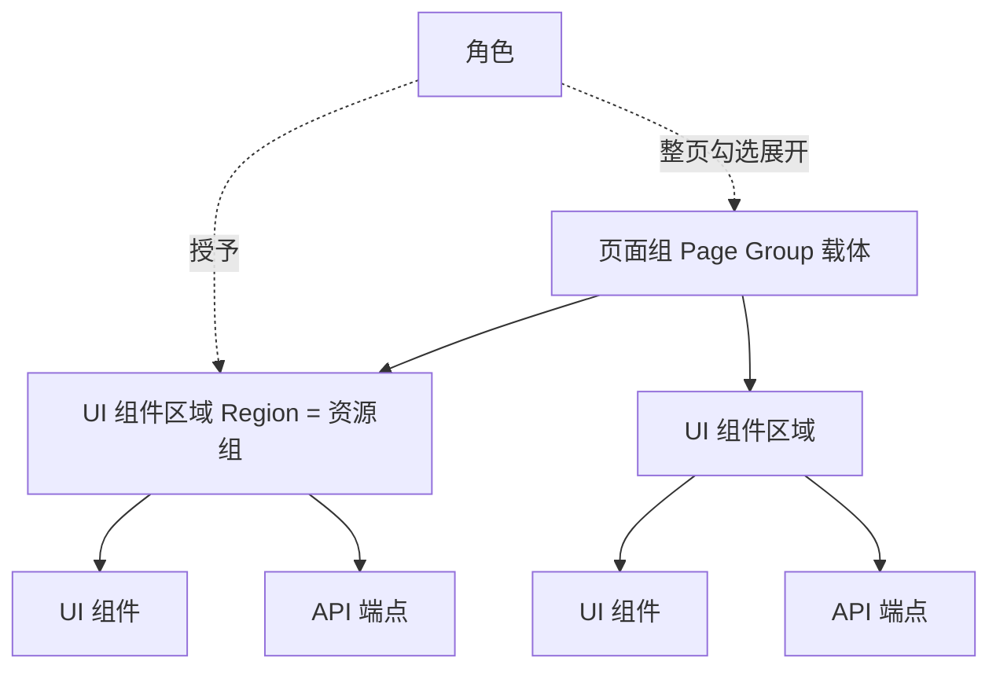

# v72 application-integration — Logical Resource Group RBAC

```mermaid
flowchart LR
  FE[taskFE hasRegion/hasPage] --> GW[APISIX]
  GW --> AUTH[taskAuth PDP]
  GW --> BIZ[业务 Go RequireRegion]
  GW --> TEN[taskTenant 多角色]
  AUTH --> SHARE[shareLib/authz]
  SHARE --> BIZ
  AUTH --> RG[(auth_resource_group page|ui_region)]
  AUTH --> RM[(auth_resource_member ui|api)]
  AUTH --> RRG[(auth_role_resource_group)]
  TEN --> AUTH
```

## 层级



- **diff 要点**: Plateau v71 → Gap（无 Region 模型/仅 FE）→ WP → Plateau v72
- **full 要点**: FE→GW→Auth/Biz + 三张新表 Access
