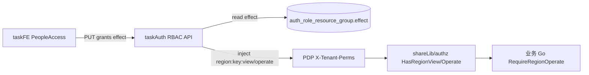

# v73 application-integration — Resource Grant Effect (Mermaid)

```mermaid
flowchart LR
  FE[taskFE PeopleAccess] -->|PUT grants effect| Auth[taskAuth RBAC API]
  Auth -->|read effect| RRG[(auth_role_resource_group.effect)]
  Auth -->|inject region:key:view/operate| PDP[PDP X-Tenant-Perms]
  PDP --> Authz[shareLib/authz HasRegionView/Operate]
  Authz --> Biz[业务 Go RequireRegionOperate]
```

## 变更摘要

- 🟢 effect 列 + EmitLogicalRGCodes
- 🟡 PDP / 访问管理矩阵 / Enforce API
