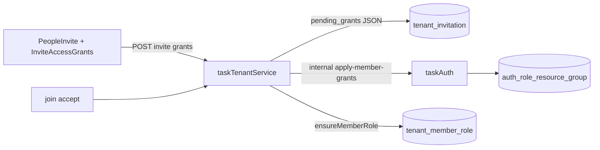

# v74 — Invite Pending Access Grants

```mermaid
flowchart LR
  FE[PeopleInvite + InviteAccessGrants] -->|POST invite grants| TT[taskTenantService]
  TT -->|pending_grants JSON| INV[(tenant_invitation)]
  Join[join accept] --> TT
  TT -->|internal apply-member-grants| TA[taskAuth]
  TA --> RRG[(auth_role_resource_group)]
  TT -->|ensureMemberRole| MR[(tenant_member_role)]
```

- **Version:** 74 target
- **Iteration:** invite-pending-access-grants-v74
- **Based on:** v73
