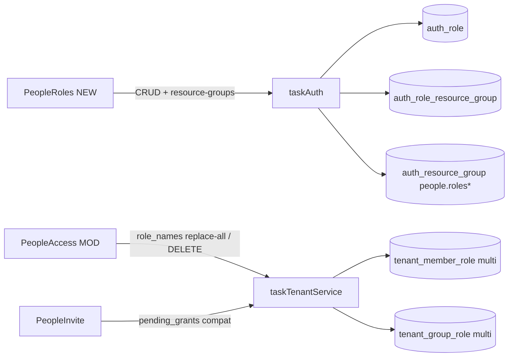

# v75 — Tenant Role Management (reusable roles + multi-role union)

- **Version:** 75 current (shipped 2026-08-11)
- **Iteration:** tenant-role-management-v75
- **Based on:** v74
- **Decisions:** Q1=C, Q2=A, Q3=B, Q4=A; RequirePerm coarse codes not removed in this version
