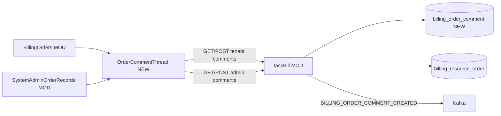

# v76 — Billing Order Comments (tenant ↔ system admin)

- **Version:** 76 target
- **Iteration:** billing-order-comments-v76
- **Based on:** v75
- **Decisions:** 扁平时间线；tenant write=`billing:manage`；admin=`IsPlatformStaff`；事件不含正文
