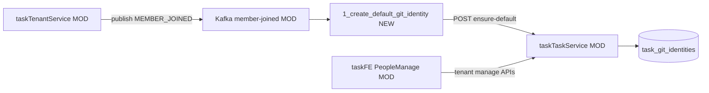

# v77 — Member Joined Auto Git Identity

- **Version:** v77 target
- **Iteration:** member-joined-auto-git-identity-v77
- **Based on:** v76
- **Decisions:** 复用 MEMBER_JOINED；默认邮箱 `sha256` 哈希 + `@daydaymoney.com`；鉴权 self / `member:manage` / `group-members:manage`
