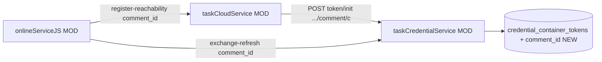

# v78 — Comment-Scoped Container Token

```mermaid
flowchart LR
  Cloud[taskCloudService MOD] -->|POST token/init .../comment/c| Cred[taskCredentialService MOD]
  Cred --> Tok[(credential_container_tokens + comment_id NEW)]
  OSJS[onlineServiceJS MOD] -->|exchange-refresh comment_id| Cred
  OSJS -->|register-reachability comment_id| Cloud
```

- **Version:** v78 target
- **Iteration:** comment-scoped-container-token-v78
- **Based on:** v77
- **Decisions:** ADR-0005；签发强制 comment；校验兼容旧容器无 comment
