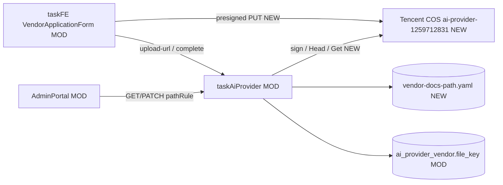

# v79 — Vendor Docs COS Presign

- **Version:** v79 target
- **Iteration:** vendor-docs-cos-presign-v79
- **Based on:** v78
- **Decisions:** ADR-0006；浏览器预签名 PUT；密钥仅 `config.local.yaml`；路径规则写回 conf 片段
