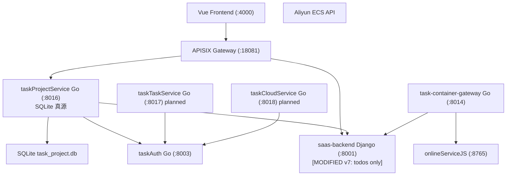

# v7 Application Integration — Mermaid Diagram

> 架构版本: v7 🎯 target | 作者: claude | 日期: 2026-07-06 17:10
> 迭代: 任务域 Go 真源 — Django Todo 零残留

## v7 数据流变更

| 数据流 | v6 | v7 |
|--------|----|----|
| GW → TPS | 新增路由 | ✅ 生产路径 |
| TPS → Django | company 校验 + **Strangler fallback** | **仅 company 校验** |
| TPS → SQLite | 未显式 | 🟢 **唯一读写真源** |
| Django projects/views | DEPRECATED | 🔴 **已删除** (migration 0051) |
| GW → BE (projects/todos) | — | Todo 仍走 Django |

## 变更图例

| 标记 | 含义 |
|------|------|
| 🟡 TPS | [MODIFIED v7] 无 fallback，SQLite 真源 |
| 🟡 BE | [MODIFIED v7] 项目域路由/表已删 |
| 🟢 SQLITE | [NEW v7] 项目域数据文件 |
| 🔴 BE_PROJ | 已移除（不再出现在拓扑中） |
