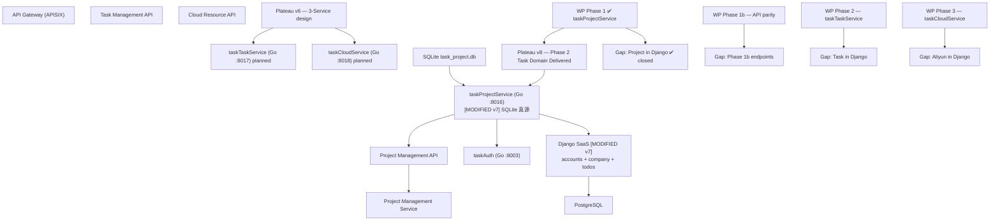

# v7 Enterprise Landscape — Mermaid Diagram

> 架构版本: v7 🎯 target | 作者: claude | 日期: 2026-07-06 17:10
> 迭代: 任务域 Go 真源 — Django Todo 零残留



## v7 变更要点

| 标记 | 内容 |
|------|------|
| 🟡 tps | SQLite 唯一真源，无 Django fallback |
| 🟡 django | projects_* 表与公网 CRUD 已删，Todo 保留 loose workspace_id |
| 🟢 sqlite | 项目域数据存储从 PostgreSQL 迁至 SQLite 文件 |
| ✅ gapProj | WP Phase 1 已关闭（502 修复 + 切流 + migration 0051） |
| ⏳ gapRem | Phase 1b：switch-workspace、gitlab-sync 等待补 |

## 架构变迁 v6→v7

```
Plateau v6 (design) ──WP1──▶ Gap: Project in Django (closed)
                              ──▶ Plateau v8 (Phase 1 live)
                              ──WP1b──▶ Gap: Phase 1b endpoints
Plateau v6 ──WP2/3──▶ Gap: Task / Cloud (open)
```
