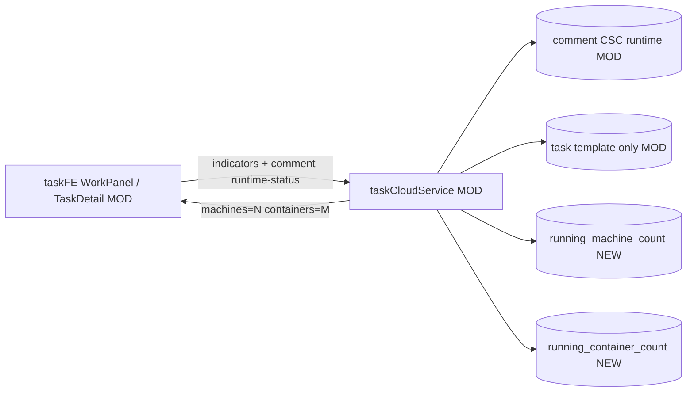

# v80 — Task-level running machine/container counts

- **Version:** v80 target
- **Iteration:** task-level-running-comment-server-count-v80
- **Based on:** v79
- **Decisions:** 任务级只标记运行中机器数与容器数；运行态只存评论 CSC；Starting 不计入机器数
