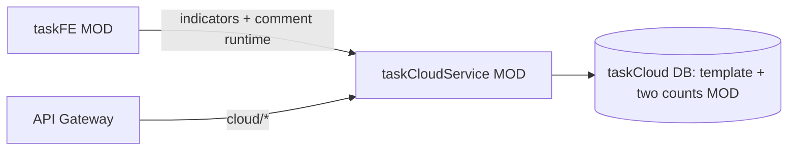

# v80 — Enterprise Landscape: task-level running counts

- **Version:** v80 target
- **Iteration:** task-level-running-comment-server-count-v80
- **Based on:** v79
- **Decisions:** 任务级 CSC 仅模板 + `running_machine_count` / `running_container_count`；运行态只存评论 CSC
