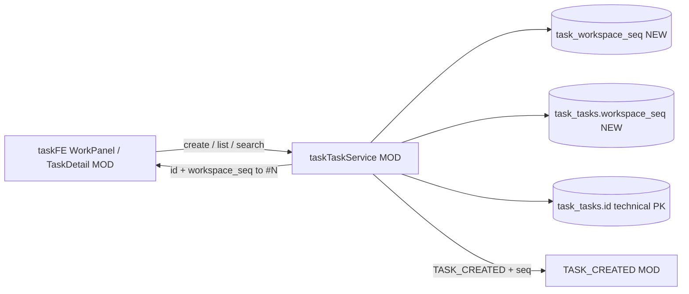

# v81 — Workspace task display sequence

- **Version:** v81 target
- **Iteration:** workspace-task-display-seq-v81
- **Based on:** v80
- **Decisions:** 技术主键不变；工作空间内 `workspace_seq` 展示为 `#N`；存量清空不回填
