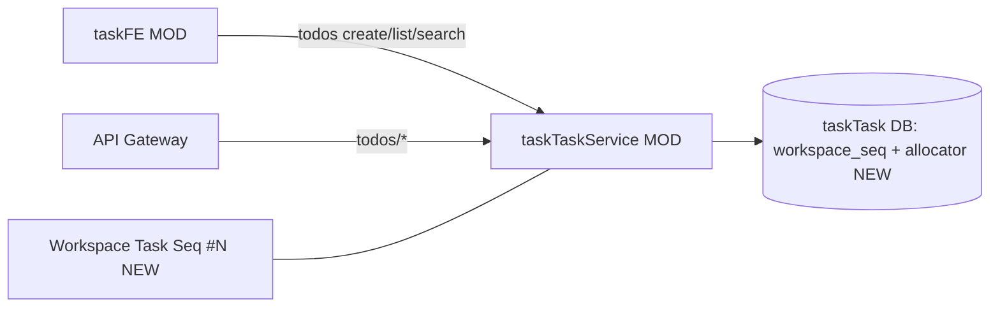

# v81 — Enterprise Landscape: workspace task display sequence

- **Version:** v81 target
- **Iteration:** workspace-task-display-seq-v81
- **Based on:** v80
- **Decisions:** 人读序号与技术主键分离；发号在任务库事务内；展示 `#N`
