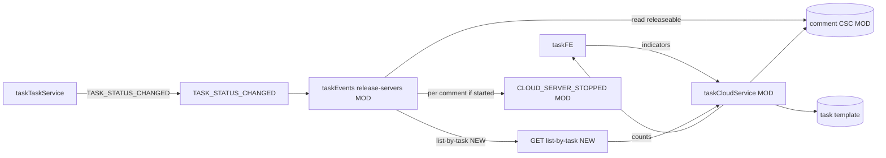

# v82 — Terminal release comment CSC

- **Version:** v82 target
- **Iteration:** terminal-release-comment-csc-v82
- **Based on:** v80
- **Decisions:** 终态按评论 CSC 逐台释放；空模板 / 无运行资源 success no-op，禁止 retry 至 DLT
