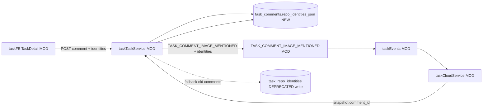

# v83 — Comment-level repo identity

```mermaid
flowchart LR
  FE[taskFE TaskDetail MOD] -->|POST comment + identities| Task[taskTaskService MOD]
  Task --> JSON[(task_comments.repo_identities_json NEW)]
  Task -->|TASK_COMMENT_IMAGE_MENTIONED + identities| Evt[TASK_COMMENT_IMAGE_MENTIONED MOD]
  Evt --> Events[taskEvents MOD]
  Events --> Cloud[taskCloudService MOD]
  Cloud -->|snapshot comment_id| Task
  Task --> JSON
  Task -.->|fallback old comments| Legacy[(task_repo_identities DEPRECATED write)]
```

- **Version:** v83 target
- **Iteration:** comment-level-repo-identity-v83
- **Based on:** v81
- **Decisions:** 运行身份随评论；关联项目只读；禁止双写任务级身份表
