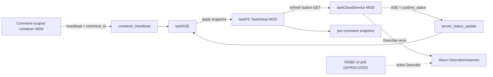

# v84 application-integration — comment-runtime-push-sync

直播：容器 / Cloud 主动推送 → taskSSE → taskFE 写入该评论 snapshot。  
对账：仅「刷新状态」按钮触发一次 Describe。  
废弃：前端与服务端 UI ticker。

```mermaid
flowchart LR
  Ctr["Comment-scoped container NEW"] -->|heartbeat + comment_id| HB["container_heartbeat"]
  HB --> SSE["taskSSE"]
  Cloud["taskCloudService MOD"] -->|SSE + runtime_status| ST["server_status_update"]
  ST --> SSE
  SSE -->|apply snapshot| FE["taskFE TaskDetail MOD"]
  FE --> Snap["per-comment snapshot"]
  FE -->|refresh button GET| Cloud
  Cloud -->|Describe once| Aliyun["Aliyun DescribeInstances"]
  Poll["FE/BE UI poll DEPRECATED"] -.->|ticker Describe| Aliyun
```
